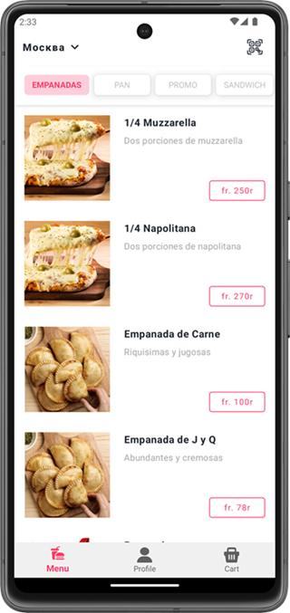
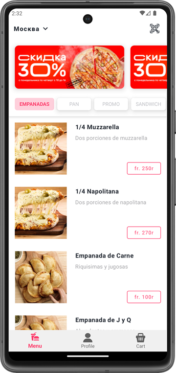

# FoodDelivery TestApp

## 1. Используемые технологии

1. Navigation API
2. MVVM / Clean Architecture (ViewModel, StateFlow)
3. Dagger / Hilt
4. Room
5. Retrofit
6. Coil (Image Downloader)
7. CollapsingToolbarLayout

## 2. Технические особенности

- Кеширование Remote данных и скачиваемых изображений

## 3. Реализованные фичи

- Сокрытие плашки с акциями при скроле

## 4. Тех задание

[Дизайн](https://www.figma.com/file/8FvAWXCD2oD9oSDHx9xFfU/%D0%A2%D0%B5%D1%81%D1%82%D0%BE%D0%B2%D0%BE%D0%B5-%D0%B7%D0%B0%D0%B4%D0%B0%D0%BD%D0%B8%D0%B5-Android?node-id=0%3A1)

- Главный экран приложения доставки еды, дизайн по ссылке выше
- Основная задача - сделать идентичную планку с категориями и блок меню
- Планка с категориями при скролле должна прилипать к верхнему бару
- В качестве API использовать любой открытый источник подходящий под текущие нужды
- Offline-режим: т.е. в случае, если нет доступа к сети, показывать последние загруженные данные(и ленту, и детали).

## 5. Скриншоты

